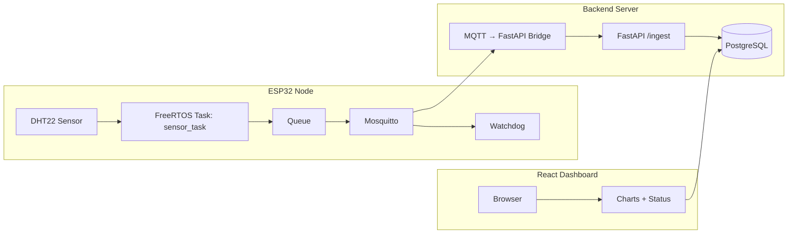
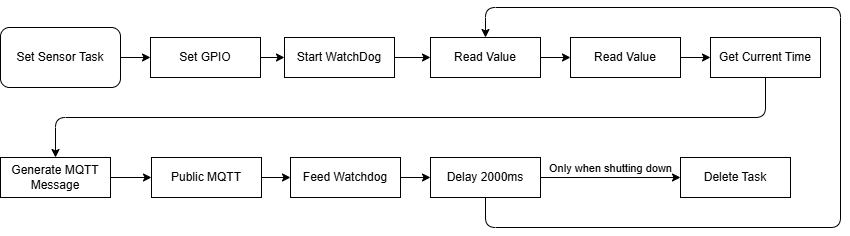
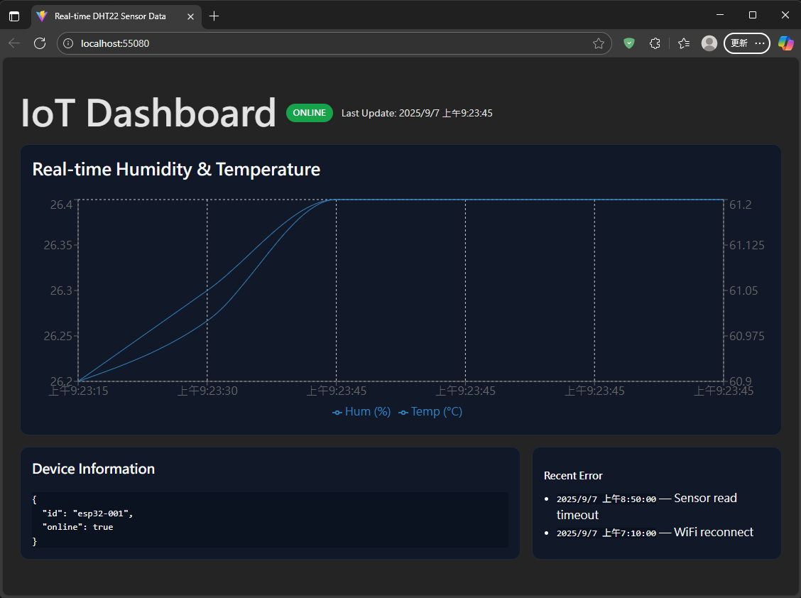

# ESP32-Iot-Web

A full-stack IoT system that integrates an ESP32 node, a FastAPI backend, and a React-based dashboard for real-time environmental monitoring.
The ESP32 periodically collects sensor data (temperature, humidity) and publishes it to an MQTT broker. The backend processes, stores, and exposes data via REST APIs and Prometheus metrics, while the web dashboard visualizes live and historical readings.

---

# Features

- ESP32-based data acquisition using DHT22 sensor
- Send temperature and humidity data via MQTT to FastAPI server
- PostgreSQL for sensor data storage
- React & Vite front-end for real-time graph display

---

## Project Structure

```
ESP32-IoT-Web/
├── firmware/           # ESP32 (ESP-IDF / FreeRTOS)
│   ├── main/
│   ├── components/
│   └── CMakeLists.txt
├── server/             # FastAPI backend
│   ├── app/
|   ├── tests/
│   ├── pyproject.toml
│   └── Dockerfile
├── web/                # React dashboard (Vite + Chart.js)
│   ├── src/
│   └── package.json
├── infra/              # Docker Compose stack (broker + db + services)
│   ├── docker-compose.yml
    └── mosquitto.conf
└── README.md
```

---

# System Diagram



---

# ESP32 Sequence

Initialization process include connecting WiFI, MQTT modules and starting DHT sensor.


Sensor_Task responsible for reading temperature & humidity from DHT22 and send reading via MQTT every 2000 ms.


---

# Requirements

## Hardware Requirements

- ESP32-S2 (or NodeMCU-32S Dev Board)
- DHT22 sensor module
- Jumper wires
- Micro USB cable
- Personal PC
- WiFi AP

---

## Software Requirements

- VSCode with ESP-IDF (v6.0.0)
- Docker

# Environment

## Development with Docker

The repository ships with a multi-service Compose stack that provisions PostgreSQL , Mosquitto, the FastAPI backend, and the React dashboard with a single command. This ensures every contributor shares the same versions of the broker, API, and Web UI.

```bash
cd infra
docker compose up --build
```

## Ports

The services expose the following ports:

- `1883` – Mosquitto MQTT broker
- `50080` – Web server (`http://localhost:50080`)
- `5432` – PostgreSQL Database
- `8000` – FastAPI application (`http://localhost:8000`)

Code changes in the `server/` and `web/` directories are mounted into their respective containers, so hot reloading works out of the box for FastAPI (`uvicorn --reload`) and the Vite dev server.

## MQTT Message Structure

Below is the MQTT message structure
| Name | Type |
| ---- | ---- |
| deviceID | Char |
| ts | Timestamp |
| temperature | float |
| humidity | float |
| seq | int |

---

## Getting Started

### ESP32

1. Open `firmware` folder using ESP-IDF or VS code with ESP-IDF extension. (This project use ESP-IDF v6.0.0)
2. Open `firmware\sdkconfig`.
3. Modify `CONFIG_EXAMPLE_WIFI_SSID` to your WiFi SSID.
4. Modify `CONFIG_EXAMPLE_WIFI_PASSWORD` to your WiFi password.
5. Modify `CONFIG_BROKER_URL` to your MQTT broker.
6. Connect sensor to ESP32 board.
7. Connect ESP32 to computer.
8. Select Port to ESP32 to upload code.
9. Select device to `esp32`
10. Click `Flash Device` (or `Build, Flash and Monitor`)
11. ESP-IDF Console will show successfully build and flash.
12. If WiFI is connected and sensor works normally, console will looks like this

```text
I (8647) Project: NodeMCU-32S-Iot: === Reading DHT ===
I (8647) Project: NodeMCU-32S-Iot: Hum: 84.0 Tmp: 26.5
I (8657) Project: NodeMCU-32S-Iot: MQTT publish [Test] id=19035 payload={"deviceId":"esp32-1","ts":"2025-10-20T00:00:08Z","temperature":26.50,"humidity":84.00,"seq":1}
I (8657) Project: NodeMCU-32S-Iot: DHT task high-water mark: 2060 bytes
```

### Web

1. Install docker in your computer.
2. cd `infra`
3. `docker compose up` and wait for a while
4. Console will show each container startup successfully (mosquitto-1, postgres-1, app-1, web-1)
5. Console will show below message if receive MQTT message

```text
app-1        | [MQTT] topic=Test payload={"deviceId":"esp32-1","ts":"2025-10-20T00:00:08Z","temperature":26.50,"humidity":84.00,"seq":1}
```

6. Use web brower to open `http://localhost:50080` to check visualization sensor data.
7. Use `docker-compose down` to shutdown all docker container. (or `docker-compose down -v` to shutdown and remove all data.)

---

## Output

After the docker-compose is deployed, use web browser to connect to `localhost:50080` and it should looks like this image


---

## Troubleshooting

### ESP32

1. Can't connect to ESP32 -> Check your UART port using "Device Manager" in Windows system
2. The temperature and/or humidity reading shows `Failed to read DHT` -> Sensor's jumper might not working
3. Led light on ESP32 EVB is not working -> Check voltage output
4. WiFi timeout -> ESP32 only supports 2.4Ghz WiFi. Some WiFi AP have issues with IoT devices(like Ubiquiti AP). Try to use laptop mobile hotspot.

### Webserver

1. Cannot connect to server -> Check IP address of the server and the IP address in `app.py`
2. ESP32 shows WiFi is connected, but no data shown on the web server -> Check your firewall

---

## Future Improvements

1. OTA firmware updates for remote devices
2. Role-based authentication for API access
3. Historical data export / analytics modules

---

## License

MIT License. Feel free to use and modify this project for your personal or academic purposes.
