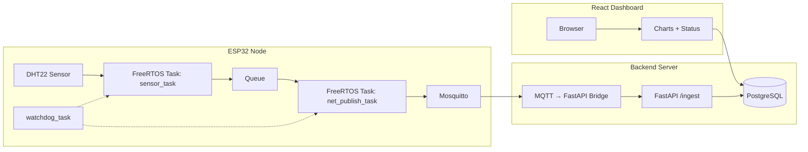

# NodeMCU-32S-Iot-Web

A full-stack IoT system that integrates an ESP32 node, a FastAPI backend, and a React-based dashboard for real-time environmental monitoring.
The ESP32 periodically collects sensor data (temperature, humidity) and publishes it to an MQTT broker. The backend processes, stores, and exposes data via REST APIs and Prometheus metrics, while the web dashboard visualizes live and historical readings.

---

## Architecture

[ESP32] --(via HTTPS POST)--> [Flask API Server (Python)] --> [SQLite / CSV] --> [Web UI]

### ESP32 Sequence
Overall process is shown as below flowchart
<!-- TBD: Add image -->

Initialization process include connecting WiFI, starting DHT sensor and MQTT modules.
<!-- TBD: Add image -->

Sensor_Task responsible for reading temperature & humidity from DHT22 and send reading via MQTT every 2000 ms.
<!-- TBD: Add image -->
---
## Features

- ESP32-based data acquisition using DHT22 sensor
- Send temperature and humidity data via MQTT to FastAPI server
- PostgreSQL  for sensor data storage
- React & Vite front-end for real-time graph display

---

## Hardware Requirements

- NodeMCU-32S (ESP32 Dev Board)
- DHT22 sensor module
- Jumper wires
- Micro USB cable
- Personal PC
- WiFi AP
---

## Software Requirements

- VSCode with ESP-IDF (v6.0)
- Docker

## Development with Docker

The repository ships with a multi-service Compose stack that provisions PostgreSQL , Mosquitto, the FastAPI backend, and the React dashboard with a single command. This ensures every contributor shares the same versions of the broker, API, and web UI.

```bash
cd infra
docker compose up --build
```

The services expose the following host ports:
- `1883` – Mosquitto MQTT broker
- `5173` – React development server (`http://localhost:5173`)
- `5432` – PostgreSQL Database
- `8000` – FastAPI application (`http://localhost:8000`)

Code changes in the `server/` and `web/` directories are mounted into their respective containers, so hot reloading works out of the box for FastAPI (`uvicorn --reload`) and the Vite dev server.

---

## Project Structure

```
ESP32-IoT-Web/
├── firmware/           # ESP32 (ESP-IDF / FreeRTOS)
│   ├── main/
│   ├── components/
│   └── CMakeLists.txt
├── server/             # FastAPI backend
│   ├── app/
|   ├── tests/
│   ├── pyproject.toml
│   └── Dockerfile
├── web/                # React dashboard (Vite + Chart.js)
│   ├── src/
│   └── package.json
├── infra/              # Docker Compose stack (broker + db + services)
│   ├── docker-compose.yml
    └── mosquitto.conf
└── README.md
```
---

## Getting Started

### ESP32 (PlatformIO)
1. Open `esp32` folder with PlatformIO.
2. Modify `WiFiCredential.c` with your WiFi credentials and server IP.
3. Upload code to NodeMCU-32S via USB.
4. Use Serial Monitor to verify transmission.

### Flask Server
## Using virtual environment
1. Open terminal or powershell
2. Create a virtual environment name "venv" `python -m venv venv`
3. Open the environment `.\venv\Scripts\activate`
4. Install flask dependency `pip install flask`
5. Run server `python app.py`
6. Use web browser to open server webpage to explore history data and upload sensor calibration data.

---
## Output
After the docker-compose is deployed, use web browser to connect to `localhost:5173` and it should looks like this image


---

## Troubleshooting
### ESP32
1. Can't connect to ESP32 -> Check your UART port using "Device Manager" in Windows system
2. The temperature and/or humidity reading shows `Failed to read DHT` -> Sensor's jumper might not working
3. Led light on ESP32 EVB is not working -> Check voltage output
4. WiFi timeout -> ESP32 only supports 2.4Ghz WiFi. Some WiFi AP have issues with IoT devices(like Ubiquiti AP). Try to use laptop mobile hotspot.


### Webserver
1. Cannot connect to server -> Check IP address of the server and the IP address in `app.py`
2. ESP32 shows WiFi is connected, but no data shown on the web server -> Check your firewall

---

## Future Improvements
1. OTA firmware updates for remote devices
2. Role-based authentication for API access
3. Historical data export / analytics modules
---

## License
MIT License. Feel free to use and modify this project for your personal or academic purposes.
